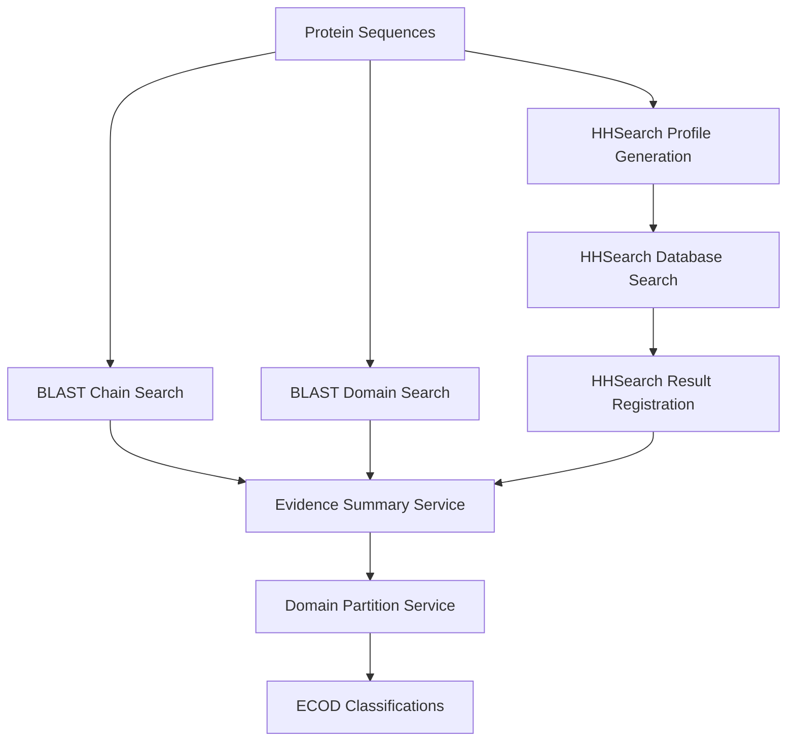

# ECOD Pipelines Module

## Overview

The ECOD Pipelines module provides a comprehensive system for protein domain classification and analysis. It coordinates multiple computational approaches including BLAST searches, HHSearch profile-based searching, and domain boundary identification to classify protein domains according to the ECOD (Evolutionary Classification of Protein Domains) hierarchy.

## Architecture

```
ecod/pipelines/
├── blast_pipeline.py              # BLAST search coordination
├── hhsearch_pipeline.py           # HHSearch profile generation and searching
├── orchestrator.py                # Legacy monolithic orchestrator (DEPRECATED)
├── hhsearch/                      # Modern HHSearch processing services
│   ├── service.py                 # High-level registration service
│   ├── processor.py               # HHR parsing and XML conversion
│   ├── file_manager.py            # File discovery and migration
│   └── models.py                  # Data structures
├── domain_analysis/               # Domain identification and classification
│   ├── pipeline.py                # Main domain analysis coordinator
│   ├── partition/                 # Domain boundary identification
│   ├── summary/                   # Evidence collection and processing
│   └── routing.py                 # Processing path optimization
└── orchestration/                 # Modern pipeline orchestration (NEW)
    ├── service.py                 # High-level orchestration service
    ├── models.py                  # Pipeline execution models
    └── stage_manager.py           # Stage dependency management
```

## Pipeline Modes

### 1. FULL Mode (Complete Pipeline)
```
Protein Sequences
    ↓
BLAST Searches (Chain + Domain)
    ↓
HHSearch Profile Generation
    ↓
HHSearch Database Searching
    ↓
HHSearch Result Registration
    ↓
Domain Evidence Summary (BLAST + HHSearch)
    ↓
Domain Boundary Identification
    ↓
ECOD Classification Assignment
```

### 2. BLAST_ONLY Mode (Simplified Pipeline)
```
Protein Sequences
    ↓
BLAST Searches (Chain + Domain)
    ↓
Domain Evidence Summary (BLAST only)
    ↓
Domain Boundary Identification
    ↓
ECOD Classification Assignment
```

### 3. ANALYSIS_ONLY Mode (Evidence Processing)
```
Existing Evidence Files
    ↓
Domain Evidence Summary
    ↓
Domain Boundary Identification
    ↓
ECOD Classification Assignment
```

## Core Components

### BLAST Pipeline (`blast_pipeline.py`)

Coordinates BLAST searches against ECOD reference databases.

**Key Features:**
- Chain-wise BLAST (finds similar protein chains)
- Domain-wise BLAST (finds similar domains)
- Batch processing with SLURM job management
- Standardized file path handling
- Progress tracking and error recovery

**Usage:**
```python
from ecod.pipelines.blast_pipeline import BlastPipeline

# Initialize pipeline
blast = BlastPipeline(context)

# Get unclassified proteins
chains = blast.get_unclassified_chains(limit=100)

# Create batch
batch = blast.create_batch(chains)

# Run searches
chain_jobs = blast.run_chain_blast(batch.id)
domain_jobs = blast.run_domain_blast(batch.id)
```

### HHSearch Pipeline (`hhsearch_pipeline.py`)

Handles HMM profile-based searching for remote homology detection.

**Key Features:**
- HHblits profile generation from sequence databases
- HHsearch against ECOD HMM database
- Profile and search result management
- Integration with SLURM job scheduler

**Usage:**
```python
from ecod.pipelines.hhsearch_pipeline import HHSearchPipeline

# Initialize pipeline
hhsearch = HHSearchPipeline(context)

# Generate profiles
profile_jobs = hhsearch.generate_profiles(batch_id)

# Run searches
search_jobs = hhsearch.run_hhsearch(batch_id)
```

### HHSearch Services (`hhsearch/`)

Modern service-oriented approach for HHSearch result processing.

**Key Components:**
- **`HHSearchRegistrationService`**: Discovers, validates, and registers HHR files
- **`HHRToXMLConverter`**: Converts HHR results to standardized XML format
- **`HHSearchFileManager`**: Handles file discovery across standard and legacy locations

**Usage:**
```python
from ecod.pipelines.hhsearch.service import create_service

# Create service
service = create_service()

# Register results for a batch
results = service.register_batch(batch_id=123)
print(f"Registered: {results.registered}, Failed: {results.failed}")
```

### Domain Analysis (`domain_analysis/`)

Processes evidence from BLAST and HHSearch to identify domain boundaries.

**Key Components:**
- **Summary Service**: Collects and integrates evidence from multiple sources
- **Partition Service**: Identifies domain boundaries and assigns classifications
- **Processing Router**: Optimizes processing paths based on evidence quality

**Data Flow:**
```python
# Evidence collection
summary_service = DomainSummaryService(context)
summary = summary_service.process_protein(pdb_id, chain_id, job_dir)

# Domain partitioning
partition_service = DomainPartitionService(context)
result = partition_service.partition_protein(
    pdb_id, chain_id, summary_path, output_dir
)
```

## Pipeline Orchestration

### Legacy Orchestrator (DEPRECATED)

The original monolithic orchestrator (`orchestrator.py`) provided basic pipeline coordination but lacked modularity and sophisticated error handling.

**Issues with Legacy Approach:**
- Monolithic design difficult to maintain
- Limited error recovery options
- No stage dependency management
- Basic progress tracking

### Modern Orchestration Service (RECOMMENDED)

The new orchestration package (`orchestration/`) provides a robust, service-oriented approach.

**Key Features:**
- **Stage Management**: Clear stage dependencies and execution order
- **Checkpoint System**: Resume from last successful stage
- **Error Recovery**: Continue pipeline execution despite individual stage failures
- **Multiple Modes**: FULL, BLAST_ONLY, and ANALYSIS_ONLY execution
- **Progress Tracking**: Comprehensive status monitoring

**Usage:**
```python
from ecod.pipelines.orchestration.service import create_orchestrator

# Create orchestrator
orchestrator = create_orchestrator()

# Run full pipeline
run = orchestrator.run_pipeline(
    batch_id=123,
    mode=PipelineMode.FULL,
    force_restart=False  # Resume from checkpoint
)

# Monitor progress
status = orchestrator.get_batch_status(batch_id=123)
print(f"Current stage: {status['active_run']['current_stage']}")
```

## Data Flow and Dependencies

### Evidence Collection Flow



### Pipeline Mode Dependencies

**FULL Mode Requirements:**
1. BLAST searches (chain + domain) ✓
2. HHSearch profile generation ✓
3. HHSearch database searching ✓
4. HHSearch result registration ✓
5. Domain analysis with all evidence ✓

**BLAST_ONLY Mode Requirements:**
1. BLAST searches (chain + domain) ✓
2. Domain analysis with BLAST evidence only ✓

**ANALYSIS_ONLY Mode Requirements:**
1. Existing evidence files ✓
2. Domain analysis processing ✓

### File Dependencies

The domain analysis pipeline requires specific file types based on mode:

**BLAST_ONLY Mode Files:**
- `{pdb_id}_{chain_id}.fasta` - Protein sequence
- `{pdb_id}_{chain_id}.chain_blast.xml` - Chain BLAST results
- `{pdb_id}_{chain_id}.domain_blast.xml` - Domain BLAST results

**FULL Mode Additional Files:**
- `{pdb_id}_{chain_id}.{ref}.a3m` - HHblits profile
- `{pdb_id}_{chain_id}.{ref}.hhr` - HHsearch results
- `{pdb_id}_{chain_id}.{ref}.hhsearch.xml` - Processed HHsearch XML

## Usage Examples

### Complete Pipeline Execution

```python
from ecod.pipelines.orchestration.service import create_orchestrator
from ecod.pipelines.orchestration.models import PipelineMode

# Initialize orchestrator
orchestrator = create_orchestrator(config_path='config/config.yml')

# Run complete pipeline
run = orchestrator.run_pipeline(
    batch_id=123,
    mode=PipelineMode.FULL
)

# Check results
print(f"Pipeline completed: {run.is_complete}")
print(f"Success: {run.success}")
print(f"Duration: {run.duration:.2f}s")
```

### BLAST-Only Processing

```python
# For faster processing without HHSearch
run = orchestrator.run_pipeline(
    batch_id=123,
    mode=PipelineMode.BLAST_ONLY
)
```

### Resume Interrupted Pipeline

```python
# Resume from last successful checkpoint
run = orchestrator.resume_pipeline(batch_id=123)
```

### Individual Component Usage

```python
# Use BLAST pipeline independently
from ecod.pipelines.blast_pipeline import BlastPipeline

blast = BlastPipeline(context)
chains = blast.get_unclassified_chains(limit=50)
batch = blast.create_batch(chains)
jobs = blast.run_chain_blast(batch.id)

# Use domain analysis independently
from ecod.pipelines.domain_analysis.summary.service import DomainSummaryService

summary_service = DomainSummaryService(context)
result = summary_service.process_protein(
    pdb_id="1abc",
    chain_id="A", 
    job_dump_dir="/data/jobs/123"
)
```

## Migration Guide

### From Legacy Orchestrator

**Old Approach (DEPRECATED):**
```python
from ecod.pipelines.orchestrator import PipelineOrchestrator

orchestrator = PipelineOrchestrator()
result = orchestrator.run_full_pipeline()
```

**New Approach (RECOMMENDED):**
```python
from ecod.pipelines.orchestration.service import create_orchestrator

orchestrator = create_orchestrator()
run = orchestrator.run_pipeline(batch_id, PipelineMode.FULL)
```

### Key Migration Benefits

1. **Better Error Handling**: Continue processing despite individual failures
2. **Checkpoint System**: Resume from interruption points
3. **Modular Design**: Use individual services independently
4. **Progress Monitoring**: Detailed stage-by-stage tracking
5. **Resource Management**: Better control over computational resources

## Configuration

### Pipeline Configuration

```yaml
# config/config.yml
tools:
  blast_path: "blastp"
  hhblits_path: "hhblits"
  hhsearch_path: "hhsearch"

reference:
  chain_db: "/data/ecod/blast/ecod_chains.fasta"
  domain_db: "/data/ecod/blast/ecod_domains.fasta"
  ecod_hh_db: "/data/ecod/hhsearch/ecod_domains_hhm"
  current_version: "develop291"

orchestration:
  checkpoint_enabled: true
  continue_on_error: true
  blast_batch_size: 100
  hhsearch_threads: 8
  hhsearch_memory: "16G"
```

## Error Handling and Recovery

### Robust Error Recovery

The orchestration service provides multiple levels of error recovery:

1. **Stage-Level Recovery**: Failed stages can be retried independently
2. **Checkpoint Recovery**: Resume from last successful stage
3. **Partial Success**: Continue processing despite individual item failures
4. **Detailed Logging**: Comprehensive error tracking and reporting

### Monitoring Pipeline Health

```python
# Get comprehensive status
status = orchestrator.get_batch_status(batch_id=123)

# Check for stalled processes
stalled = orchestrator.identify_stalled_processes(batch_id=123)

# Get progress summary
summary = orchestrator.get_batch_progress_summary(batch_id=123)
```

## Performance Considerations

### Resource Optimization

- **BLAST Pipeline**: Batch processing reduces job overhead
- **HHSearch Pipeline**: Configurable thread/memory allocation
- **Domain Analysis**: Parallel processing with worker pools
- **Orchestration**: Stage-level parallelization where possible

### Scaling Guidelines

- **Small batches** (<100 proteins): Use simplified orchestration
- **Medium batches** (100-1000 proteins): Enable checkpointing and parallel processing
- **Large batches** (1000+ proteins): Use FULL mode with resource optimization

## Best Practices

1. **Use New Orchestration**: Migrate from legacy orchestrator
2. **Enable Checkpoints**: For long-running pipelines
3. **Monitor Progress**: Regular status checks for large batches
4. **Resource Planning**: Adjust thread/memory based on system capacity
5. **Error Analysis**: Review failed items for systematic issues
6. **Mode Selection**: Use BLAST_ONLY for preliminary analysis, FULL for comprehensive classification

## Contributing

When adding new pipeline components:

1. Follow the service-oriented architecture pattern
2. Implement proper error handling and recovery
3. Add comprehensive logging
4. Include progress tracking
5. Write unit tests for core functionality
6. Update documentation and examples

## License

Part of the ECOD project. See main LICENSE file for details.
